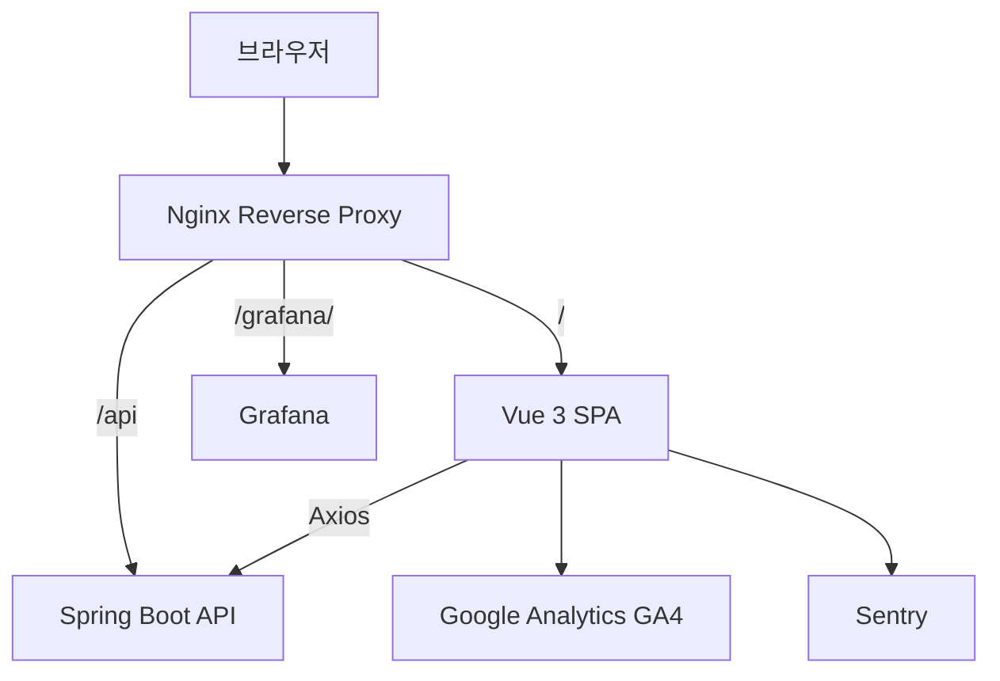
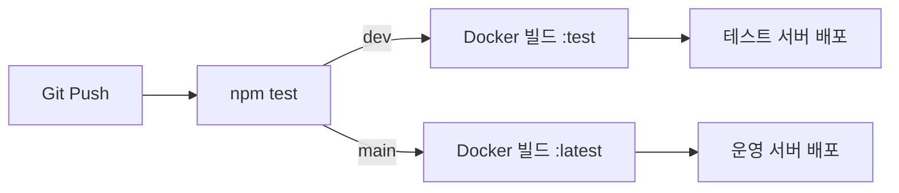

# 용산구 홈페이지 클론 — Frontend

> Vue 3 + Vuetify 3 기반 SPA | 반응형 UI · 게시판 · OAuth2 로그인 · SEO

## 프로젝트 소개

용산구청 홈페이지를 클론한 포트폴리오 프로젝트의 프론트엔드입니다.
Vue 3 Composition API + Vuetify 3를 사용하여 구정소식, 게시판, 회원가입 등을 구현했습니다.

**배포 URL**
- 운영: `https://yongsan.minhojan-world.site`
- 테스트: `https://test.minhojan-world.site`

## 기술 스택

| 분류 | 기술 |
|------|------|
| Framework | Vue 3.5 (Composition API) |
| UI | Vuetify 3.11 |
| 상태관리 | Pinia 3 |
| 라우팅 | Vue Router 4 |
| HTTP | Axios |
| 빌드 | Vite 7 |
| 아이콘 | MDI, Lucide Vue |
| 에러 추적 | Sentry (@sentry/vue) |
| 분석 | Google Analytics GA4 |
| 단위 테스트 | Vitest |
| E2E 테스트 | Playwright |
| 컨테이너 | Docker (Nginx Alpine) |
| CI/CD | GitHub Actions |

## 시스템 아키텍처



## 주요 기능

### 인증
- 이메일/비밀번호 로그인 (JWT)
- Google OAuth2 로그인
- Kakao OAuth2 로그인
- 자동 토큰 갱신 (만료 5초 전 refresh)
- 회원가입 (이메일 유효성 검사)

### 게시판
- **칭찬합시다** (board1): 비회원 글쓰기 가능 (비밀번호 보호)
- **나도한마디** (board2): 회원 전용
- 게시글 CRUD (작성/조회/수정/삭제)
- 비공개 글 (작성자/관리자만 열람)
- 페이징 + 검색
- 조회수 카운팅

### UI/UX
- Vuetify 3 Material Design
- 반응형 레이아웃
- 스티키 네비게이션 (스크롤 감지)
- 배너 슬라이더
- 브레드크럼 네비게이션
- 만족도 조사 위젯
- 스크롤 맨위로 FAB 버튼

### SEO
- 동적 `<title>` 및 메타 태그 (og:title, og:description, og:image)
- `robots.txt` + `sitemap.xml`
- Open Graph 이미지

## CI/CD 파이프라인



- `dev` push → 테스트 서버 자동 배포 (`yongsan-frontend:test`)
- `main` push → 운영 서버 자동 배포 (`yongsan-frontend:latest`)
- Docker 이미지: GHCR (`ghcr.io/rowlow0gold-ops/yongsan-frontend`)

## 프로젝트 구조

```
src/
├── api/                  API 호출 모듈
│   ├── auth.js           인증 API (login, signup, refresh, logout)
│   └── board.js          게시판 API
├── assets/               정적 리소스 (이미지)
├── components/
│   ├── auth/             LoginDialog, SignupStepsSidebar
│   ├── board/            BoardTable, FiltersCard
│   ├── participation/    Breadcrumbs, SatisfactionSurvey, SideNav, TopBar
│   ├── Nav.vue           메인 네비게이션
│   ├── Footer.vue        푸터
│   ├── BannerSlider.vue  배너 슬라이더
│   └── ...               기타 컴포넌트 (21개)
├── composables/
│   ├── useAlert.js       알림 관리
│   ├── useSeo.js         SEO 메타 태그
│   ├── useLeaveGuard.js  페이지 이탈 확인
│   ├── useTheme.js       테마 전환
│   └── useWeather.js     날씨 API
├── layouts/
│   └── ParticipationLayout.vue  게시판 공통 레이아웃
├── lib/
│   ├── api.js            Axios 인스턴스 (JWT 인터셉터)
│   └── jwt.js            JWT 유틸리티
├── plugins/
│   ├── pinia.js          Pinia 초기화
│   └── vuetify.js        Vuetify 설정
├── router/
│   └── index.js          라우터 (인증 가드 포함)
├── stores/
│   └── auth.js           인증 상태 (Pinia)
├── views/
│   ├── Home.vue          홈페이지
│   ├── Board1.vue        칭찬합시다
│   ├── Board2.vue        나도한마디
│   ├── BoardDetail.vue   게시글 상세
│   ├── BoardWrite.vue    글쓰기
│   ├── BoardEdit.vue     글수정
│   ├── Signup.vue        회원가입
│   ├── MyPage.vue        마이페이지
│   └── NotFound.vue      404 페이지
├── App.vue               루트 컴포넌트
├── main.js               앱 초기화 (Sentry, Pinia, Router, Vuetify)
└── style.css             글로벌 스타일
```

## 라우팅

| 경로 | 컴포넌트 | 인증 |
|------|----------|------|
| `/` | Home | - |
| `/board1` | Board1 (칭찬합시다) | - |
| `/board2` | Board2 (나도한마디) | - |
| `/board/:boardKey/:id` | BoardDetail | board2는 필수 |
| `/board/:boardKey/write` | BoardWrite | board2는 필수 |
| `/board/:boardKey/:id/edit` | BoardEdit | 작성자/관리자 |
| `/signup` | Signup | - |
| `/mypage` | MyPage | 필수 |
| `/*` | NotFound (404) | - |

## 테스트

```bash
# 단위 테스트 (Vitest)
npm test

# E2E 테스트 (Playwright)
npm run test:e2e

# E2E 테스트 UI 모드
npm run test:e2e:ui
```

### 단위 테스트
- JWT 파싱 유틸리티 (6개)

### E2E 테스트 (Playwright)
- **home.spec.js** — 홈페이지 로드, 네비게이션, 404 페이지
- **board.spec.js** — 게시판 목록, 글쓰기, 검색, 인증 가드
- **auth.spec.js** — 로그인 다이얼로그, 회원가입, 보호된 라우트
- **seo.spec.js** — 메타 태그 검증 (title, og:title, description, og:image)

## 로컬 실행

```bash
# Node.js 20+ 필요

# 의존성 설치
npm install

# 개발 서버 실행
npm run dev

# 빌드
npm run build
```

## 환경변수

| 변수 | 설명 | 기본값 |
|------|------|--------|
| `VITE_API_BASE_URL` | 백엔드 API URL | `http://localhost:8080` |
| `VITE_SENTRY_DSN` | Sentry DSN (선택) | - |
| `VITE_WEATHER_API_KEY` | 날씨 API 키 (선택) | - |
